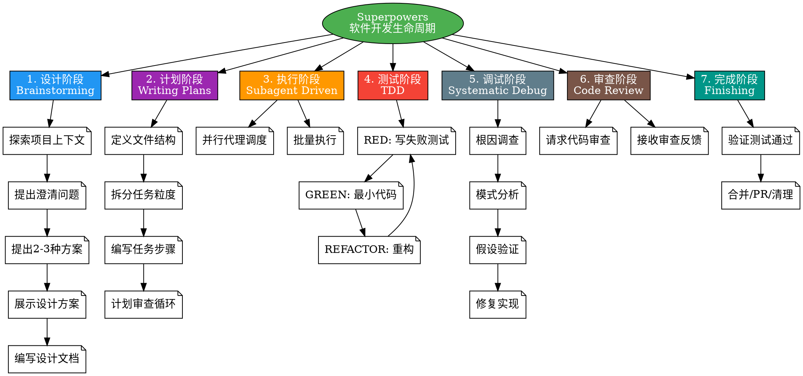
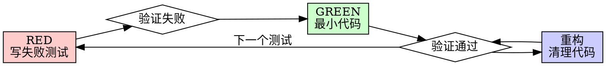
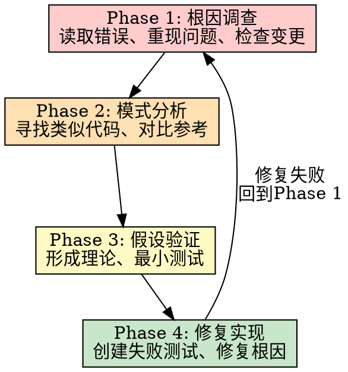
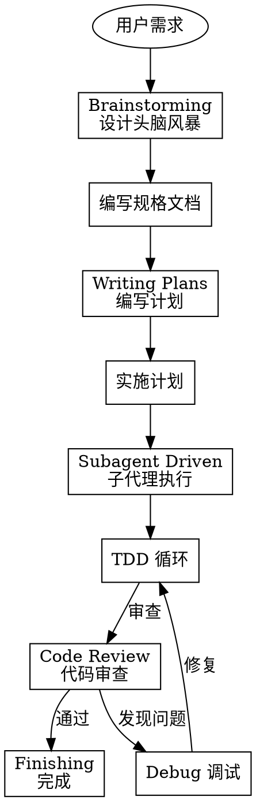

# Superpowers 技能框架使用指南

> Trae IDE 集成版 - 完整的软件开发生命周期工作流

---

## 概述

Superpowers 是一个完整的软件开发生工作流框架，集成在 Trae IDE 中。它通过一套可组合的「技能」(Skills) 来自动化软件开发的各个阶段，从需求分析到代码实现，从测试到部署。

**核心理念**：
- 在写代码之前先理解需求
- 测试驱动开发 (TDD)
- 系统化的调试方法
- 持续的小步提交

---

## 思维导图



---

## 技能总览

| 技能名称 | 触发时机 | 功能描述 |
|---------|---------|---------|
| **brainstorming** | 开始任何创意工作之前 | 需求探索与设计头脑风暴 |
| **writing-plans** | 有规格文档后、编码前 | 编写详细实施计划 |
| **test-driven-development** | 实现任何功能或修复bug时 | 测试驱动开发 |
| **subagent-driven-development** | 执行计划时 | 子代理自动开发 |
| **executing-plans** | 执行实施计划时 | 批量执行带检查点 |
| **systematic-debugging** | 遇到bug或测试失败时 | 系统化调试四步法 |
| **requesting-code-review** | 任务之间需要审查时 | 请求代码审查 |
| **receiving-code-review** | 收到审查反馈时 | 响应审查意见 |
| **finishing-a-development-branch** | 任务完成时 | 完成开发分支 |
| **using-git-worktrees** | 需要并行开发时 | Git Worktrees 隔离 |
| **verification-before-completion** | 声称完成前 | 完成前验证 |
| **dispatching-parallel-agents** | 有多个独立任务时 | 并行代理工作流 |
| **writing-skills** | 创建新技能时 | 技能编写指南 |

---

## 详细技能说明

### 1. Brainstorming - 设计头脑风暴

**触发条件**：用户想要创建功能、构建组件、添加功能或修改行为时

**核心流程**：
```
探索项目上下文 → 视觉问题识别 → 澄清问题(逐个) → 
提出方案(2-3个) → 展示设计(分节) → 用户批准 → 
编写设计文档 → 规范审查 → 用户审核 → 转入实施计划
```

**关键原则**：
- 一次只问一个问题
- 优先使用选择题
- YAGNI 原则 - 移除不必要的功能
- 增量验证 - 展示设计，获得批准后再继续

**硬性规定**：
> 🚫 在展示设计并获得用户批准之前，禁止调用任何实现技能、编写代码、搭建项目或采取任何实施行动。

---

### 2. Writing Plans - 编写实施计划

**触发条件**：有规格文档或需求后，编码前

**任务粒度**：
- 每个步骤 2-5 分钟
- 例子：
  - [ ] 写失败的测试
  - [ ] 运行测试确认失败
  - [ ] 写最小实现代码
  - [ ] 运行测试确认通过
  - [ ] 提交

**计划结构**：
```markdown
# [功能名] 实施计划

**目标：** [一句话描述]

**架构：** [2-3句方法]

---

### 任务 N: [组件名]

**文件：**
- 创建：`exact/path/to/file.py`
- 修改：`exact/path/to/existing.py:123-145`

- [ ] **步骤 1: 写失败测试**
- [ ] **步骤 2: 运行测试确认失败**
- [ ] **步骤 3: 写最小实现**
- [ ] **步骤 4: 运行测试确认通过**
- [ ] **步骤 5: 提交**
```

**计划审查循环**：
1. 编写完计划后，分发 plan-document-reviewer 子代理
2. 如果发现问题 → 修复 → 重新分发审查
3. 如果通过 → 继续下一块或执行交接

---

### 3. Test-Driven Development (TDD) - 测试驱动开发

**触发条件**：实现任何功能或修复 bug 时

**核心铁律**：
```
没有失败的测试，就不能写生产代码
```

**红-绿-重构循环**：



**步骤详解**：

| 阶段 | 动作 | 验证 |
|------|------|------|
| **RED** | 写一个最小测试，展示期望行为 | 运行测试，必须失败 |
| **GREEN** | 写最简单的代码让测试通过 | 运行测试，必须通过 |
| **REFACTOR** | 重构：移除重复、改善命名 | 所有测试保持绿色 |

**常见借口与真相**：

| 借口 | 真相 |
|------|------|
| "太简单不需要测试" | 简单代码也会坏，测试只需30秒 |
| "我手动测试过了" | 手动测试是随意的，不能重复运行 |
| "写完再测也一样" | 测试后写 = "这个做什么？" 测试先写 = "这个应该做什么？" |
| "删掉X小时的工作太浪费" | 沉没成本谬误，不能信任的代码是技术债务 |

---

### 4. Systematic Debugging - 系统化调试

**触发条件**：遇到任何 bug、测试失败或意外行为时

**核心铁律**：
```
在调查根因之前，不能提出修复方案
```

**四阶段流程**：



**Phase 1: 根因调查**
- 仔细阅读错误信息
- 一致地重现问题
- 检查最近的变更
- 追踪数据流

**Phase 2: 模式分析**
- 寻找类似工作的代码
- 对比参考实现
- 识别差异
- 理解依赖

**Phase 3: 假设和测试**
- 明确陈述假设
- 最小化修改
- 验证后再继续

**Phase 4: 实现修复**
- 创建失败测试用例
- 单一修复
- 验证修复有效

**红色警告** - 立即停止并遵循流程：
- "先试试这个，看看能不能工作"
- "一次改多个地方，一起测试"
- "跳过测试，我手动验证"
- 已经尝试 3+ 次修复，每次都暴露新问题

---

### 5. Subagent-Driven Development - 子代理开发

**触发条件**：有实施计划后需要执行时

**工作流程**：
1. 为每个任务启动新的子代理
2. 子代理执行任务
3. 两阶段审查：
   - 阶段1：规范合规性
   - 阶段2：代码质量
4. 继续下一个任务

**关键原则**：
- 每个任务使用全新的子代理
- 分离规范审查和代码审查
- 确保子代理有完整上下文

---

### 6. Requesting Code Review - 请求代码审查

**触发条件**：任务之间需要代码审查时

**审查清单**：
- [ ] 代码符合计划规范
- [ ] 无明显bug
- [ ] 遵循项目约定
- [ ] 测试覆盖充分

**问题报告按严重程度分类**：
- 🔴 阻塞性问题 - 必须修复
- 🟡 建议改进 - 应该考虑
- 🟢 可选优化 - 可以忽略

---

### 7. Finishing A Development Branch - 完成开发分支

**触发条件**：所有任务完成时

**完成检查清单**：
- [ ] 所有测试通过
- [ ] 代码已审查
- [ ] 文档已更新

**选项**：
1. **合并 (Merge)** - 合并到主分支
2. **创建 PR** - 发起Pull Request
3. **保留** - 保持分支开放继续工作
4. **丢弃** - 删除分支

---

### 8. Using Git Worktrees - Git Worktrees 并行开发

**触发条件**：需要在隔离环境并行开发时

**优势**：
- 在独立目录工作
- 不影响主分支
- 可以并行多个任务

---

### 9. Verification Before Completion - 完成前验证

**触发条件**：声称修复完成前

**必须验证**：
- 测试确实通过
- 问题不再复现
- 没有引入新问题

---

## 工作流程示例

### 完整开发流程



---

## 常用命令

### 启动技能

在对话中直接使用：

```
让我帮你设计这个功能 → 触发 brainstorming
让我写实施计划 → 触发 writing-plans
让我用TDD来实现 → 触发 test-driven-development
这个bug怎么修 → 触发 systematic-debugging
```

---

## 文件位置

- **技能目录**: `.trae/skills/`
- **设计文档**: `docs/superpowers/specs/`
- **实施计划**: `docs/superpowers/plans/`

---

## 相关文档

- [brainstorming/SKILL.md](file:///Users/jiangxiaochun/Desktop/hmwl/hmwl/.trae/skills/brainstorming/SKILL.md) - 设计头脑风暴
- [writing-plans/SKILL.md](file:///Users/jiangxiaochun/Desktop/hmwl/hmwl/.trae/skills/writing-plans/SKILL.md) - 编写计划
- [test-driven-development/SKILL.md](file:///Users/jiangxiaochun/Desktop/hmwl/hmwl/.trae/skills/test-driven-development/SKILL.md) - TDD
- [systematic-debugging/SKILL.md](file:///Users/jiangxiaochun/Desktop/hmwl/hmwl/.trae/skills/systematic-debugging/SKILL.md) - 系统调试
- [subagent-driven-development/SKILL.md](file:///Users/jiangxiaochun/Desktop/hmwl/hmwl/.trae/skills/subagent-driven-development/SKILL.md) - 子代理开发

---

*文档最后更新: 2026-03-15*
