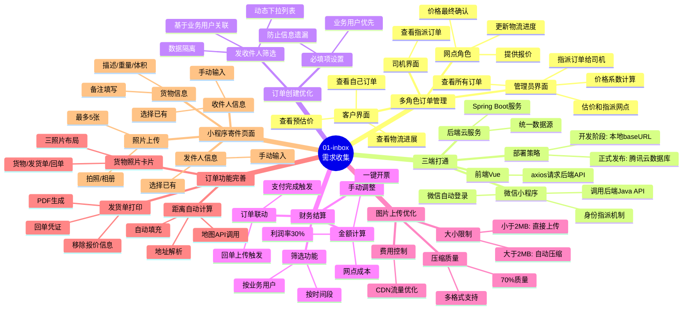
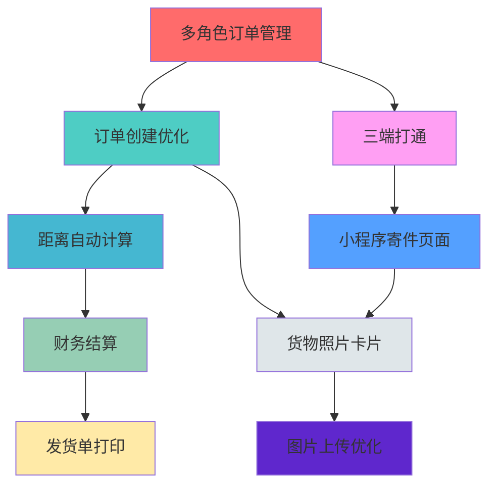
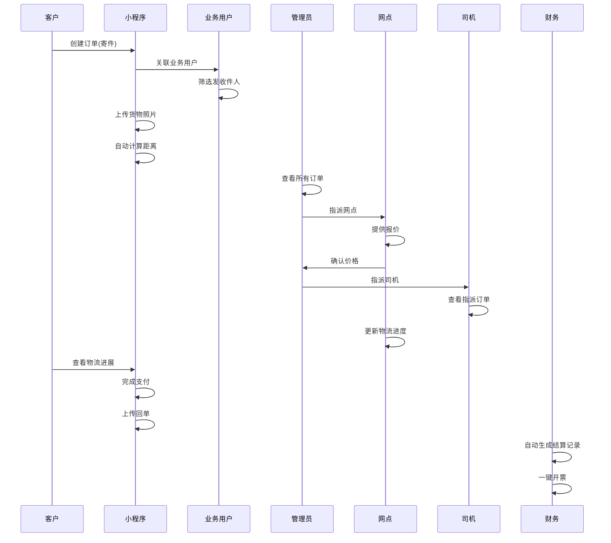

# 01-inbox 需求思维导图

## Mermaid 思维导图

## 功能分类矩阵

### 核心业务流程
| 功能模块 | 关键角色 | 业务价值 | 优先级 | 状态 |
|---------|---------|---------|-------|------|
| 多角色订单管理 | 管理员/司机/网点/客户 | 业务流程闭环 | 高 | ✅ |
| 订单创建优化 | 业务用户 | 数据完整性 | 高 | ✅ |
| 财务结算 | 财务人员 | 财务管理闭环 | 高 | ✅ |

### 系统架构
| 功能模块 | 技术范围 | 影响范围 | 优先级 | 状态 |
|---------|---------|---------|-------|------|
| 三端打通 | 小程序/Vue/后端 | 全系统 | 高 | ✅ |
| 图片上传优化 | 前端/后端/云存储 | 成本控制 | 高 | ✅ |

### 功能完善
| 功能模块 | 用户体验 | 技术复杂度 | 优先级 | 状态 |
|---------|---------|-----------|-------|------|
| 距离自动计算 | 自动化提升 | 中 | 高 | ✅ |
| 发货单打印 | 业务凭证 | 中 | 中 | ✅ |
| 货物照片卡片 | 信息完整 | 低 | 中 | ✅ |
| 小程序寄件页面 | 客户体验 | 中 | 高 | ✅ |

## 需求关联关系图

## 实现状态总览

### ✅ 已完成 (9/9)
1. ✅ 多角色订单管理系统需求
2. ✅ 小程序/VUE/后端云服务三者打通需求
3. ✅ 订单创建页面必填项及发收件人筛选功能
4. ✅ 财务结算界面功能需求
5. ✅ 图片上传大小限制与压缩功能
6. ✅ 订单距离自动计算功能
7. ✅ 订单发货单打印功能
8. ✅ 订单页面货物照片卡片
9. ✅ 小程序寄件页面改版需求

## 业务流程图

## 技术栈分布

### 前端技术
- **Vue.js**: 网页端界面
- **微信小程序**: 客户端寄件
- **Axios**: API请求

### 后端技术
- **Spring Boot**: Java服务
- **MyBatis Plus**: 数据库操作
- **腾讯云COS**: 图片存储

### 第三方服务
- **地图API**: 距离计算
- **微信云开发**: 登录认证
- **税票系统**: 开票功能

---

**思维导图版本**: v1.0  
**创建时间**: 2026-03-14  
**数据来源**: 01-inbox 文件夹
