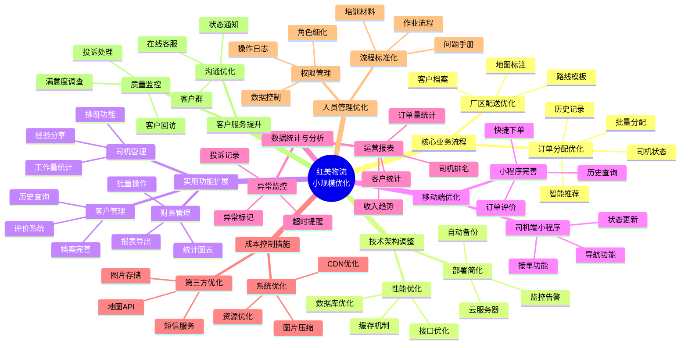
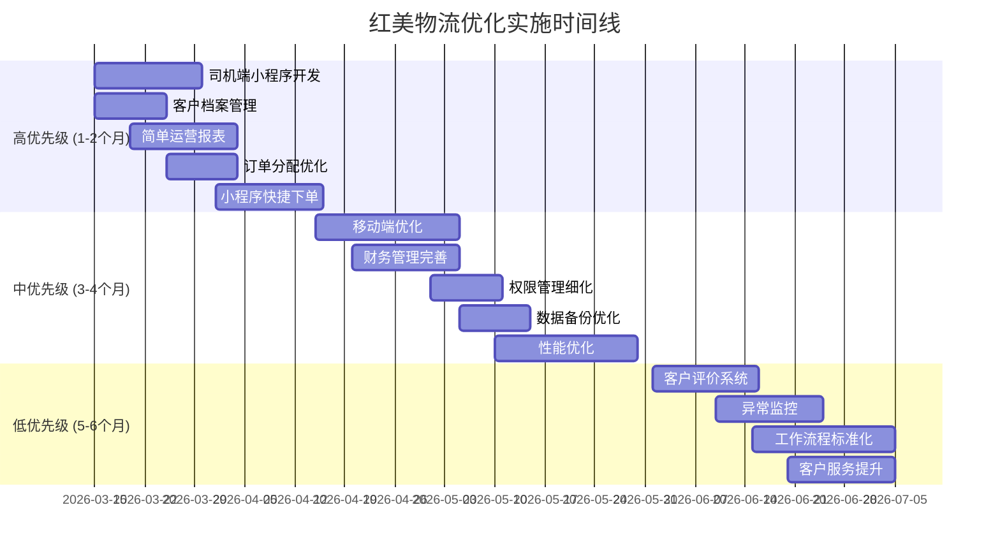
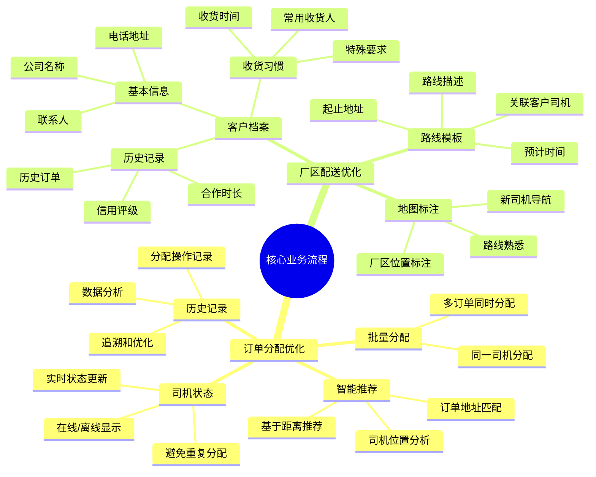
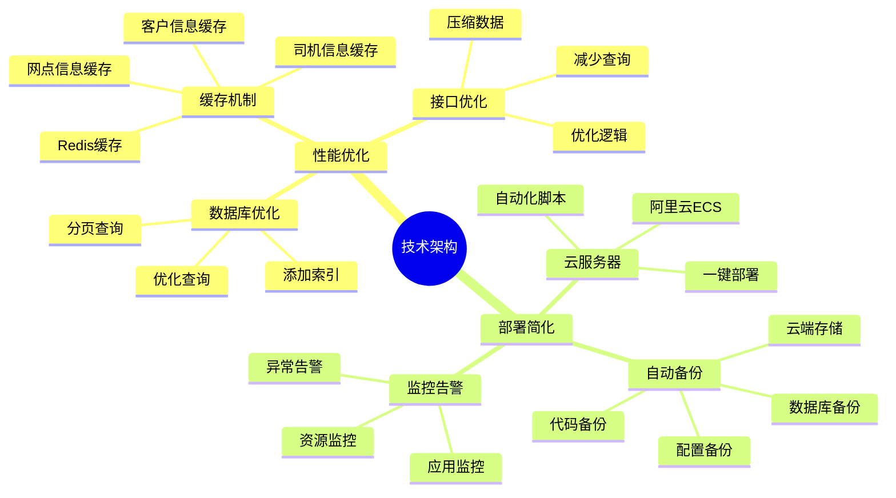
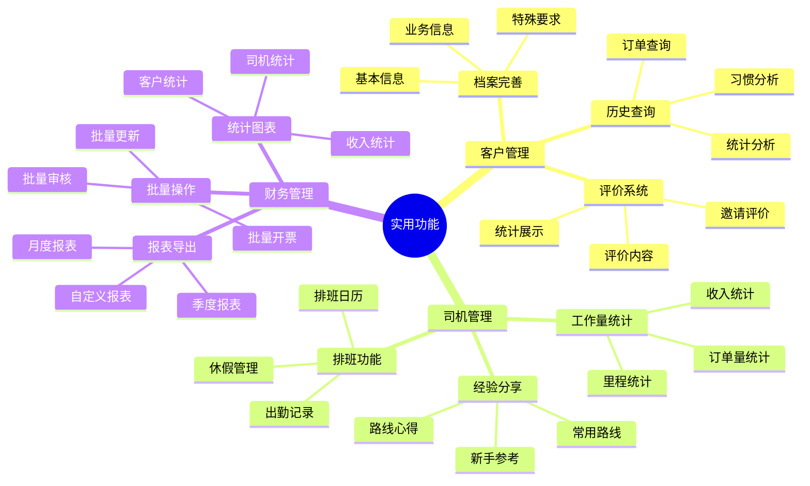
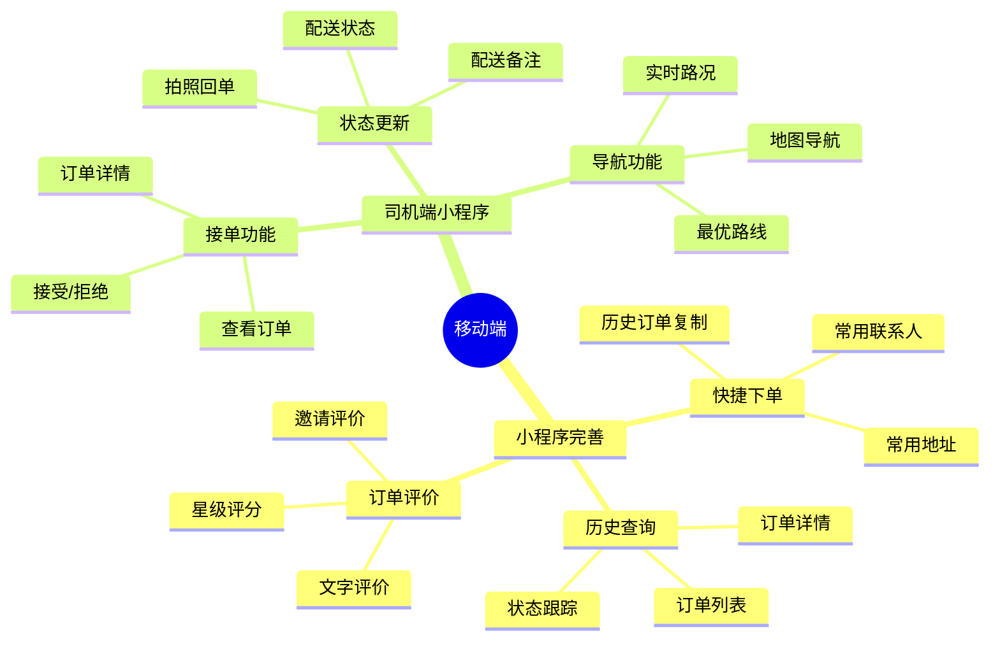
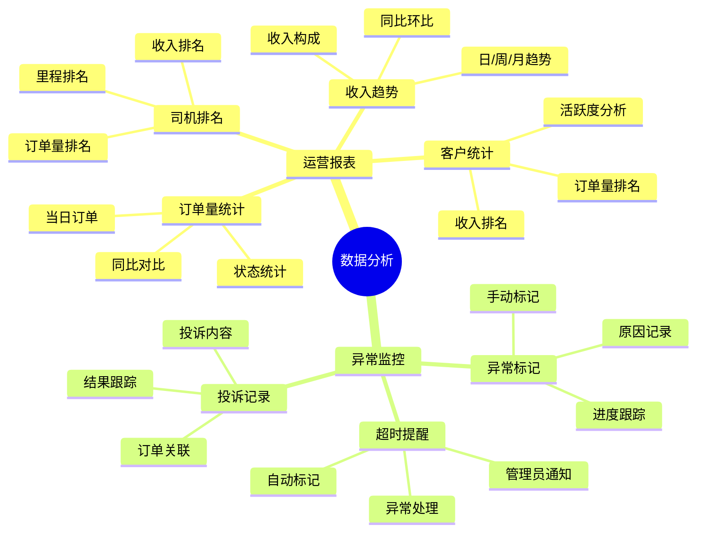
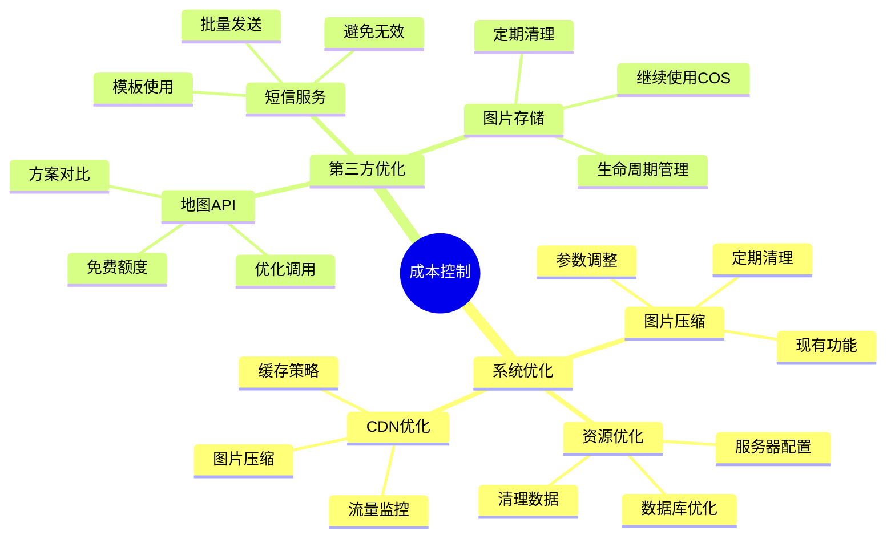
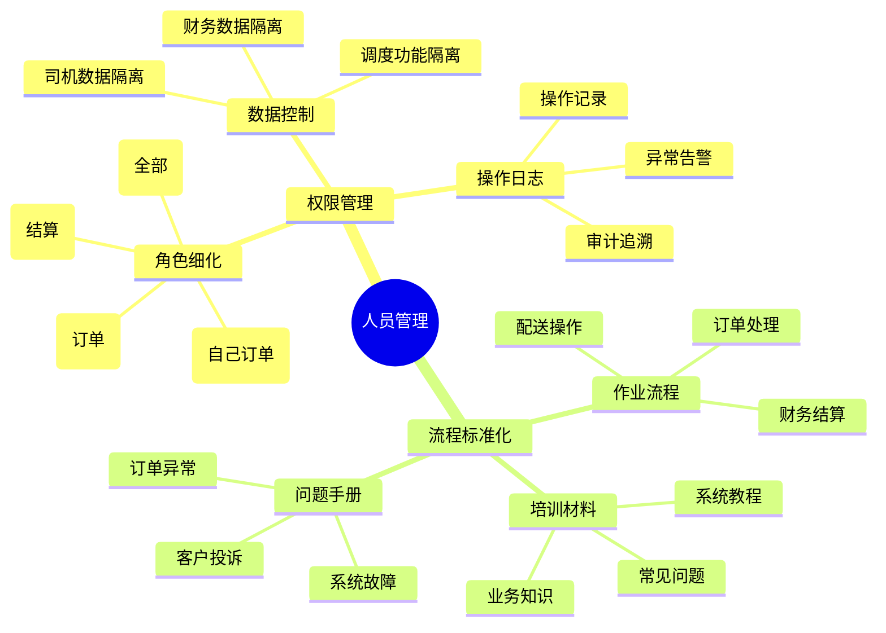
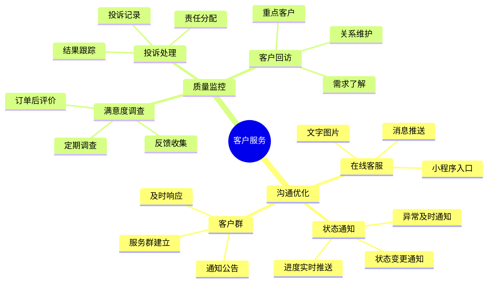

# 红美物流小规模优化需求文档

## 项目背景

- **公司规模**：10人团队
- **业务范围**：乡镇厂区物流服务
- **现有系统**：基础的多角色订单管理系统
- **优化目标**：务实、低成本、快速见效的业务优化

## 总体思维导图

## 优先级实施路线图

## 模块详细思维导图

### 1. 核心业务流程优化

### 2. 技术架构调整

### 3. 实用功能扩展

### 4. 移动端优化

### 5. 数据统计与分析

### 6. 成本控制措施

### 7. 人员管理优化

### 8. 客户服务提升

---

## 一、核心业务流程优化

### 1.1 订单分配流程优化

#### 原始想法
> 现在订单分配都是管理员手动指派，有时候会重复分配或者分配不合理，希望能有一些辅助功能提升效率。

#### 详细描述
- **批量分配功能**：支持同时选择多个订单，批量分配给同一司机
- **一键智能分配**：根据司机当前位置和订单地址，自动推荐最合适的司机
- **司机在线状态**：实时显示司机在线/离线状态，避免分配给离线司机
- **分配历史记录**：记录每次分配操作，便于追溯和优化

#### 相关想法
- 与现有订单管理模块关联
- 需要司机位置信息（可通过小程序获取）
- 需要司机状态管理功能

#### 优先级评估
- 高优先级
- 直接影响日常运营效率

#### 备注
- 初期可简化为基于距离的推荐算法
- 后续可考虑司机工作量、历史表现等因素

### 1.2 厂区配送流程优化

#### 原始想法
> 我们的客户主要是厂区，很多都是固定客户，每次下单都要重新输入地址和联系人，希望能有快捷方式。

#### 详细描述
- **客户档案管理**：为每个厂区客户建立详细档案
  - 基本信息：公司名称、联系人、电话、地址
  - 收货习惯：常用收货人、收货时间、特殊要求
  - 历史记录：历史订单、合作时长、信用评级
- **常用路线模板**：为常跑路线创建模板
  - 起止地址、路线描述、预计时间
  - 关联的客户和司机
- **厂区地图标注**：在地图上标注各厂区位置
  - 便于新司机熟悉路线
  - 支持导航功能

#### 相关想法
- 与现有客户管理模块关联
- 需要地图API集成
- 需要客户历史数据支持

#### 优先级评估
- 高优先级
- 提升客户体验和下单效率

#### 备注
- 可从小程序端优先实现
- 地图标注功能可后期添加

## 二、技术架构调整（轻量化）

### 2.1 性能优化

#### 原始想法
> 系统有时候会有点慢，特别是订单多的时候，希望能快一点。

#### 详细描述
- **数据库查询优化**
  - 为常用查询字段添加索引
  - 优化复杂查询语句
  - 实现分页查询，避免一次加载过多数据
- **缓存机制**
  - 使用Redis缓存热点数据
  - 缓存客户信息、网点信息、司机信息
  - 设置合理的缓存过期时间
- **接口响应优化**
  - 减少不必要的数据库查询
  - 优化业务逻辑处理
  - 压缩响应数据

#### 相关想法
- 与现有后端架构关联
- 需要引入Redis缓存
- 需要数据库性能分析

#### 优先级评估
- 中优先级
- 提升系统整体性能

#### 备注
- 可逐步实施，先优化最慢的接口
- 需要性能测试验证效果

### 2.2 部署方案简化

#### 原始想法
> 现在部署比较麻烦，希望能简单一点，最好一键部署。

#### 详细描述
- **云服务器部署**
  - 使用阿里云/腾讯云ECS
  - 配置自动化部署脚本
  - 实现一键部署和更新
- **自动备份**
  - 数据库定期自动备份
  - 代码和配置文件备份
  - 备份文件云端存储
- **监控告警**
  - 服务器资源监控
  - 应用状态监控
  - 异常情况告警

#### 相关想法
- 与现有部署流程关联
- 需要云服务配置
- 需要监控工具集成

#### 优先级评估
- 中优先级
- 降低运维成本和风险

#### 备注
- 可选择云服务商提供的运维工具
- 初期可简化监控功能

## 三、实用功能扩展

### 3.1 客户管理增强

#### 原始想法
> 客户信息现在比较简单，希望能更详细一些，方便管理和服务。

#### 详细描述
- **客户档案完善**
  - 基本信息：公司名称、联系人、电话、地址
  - 业务信息：合作时间、订单量、信用评级
  - 特殊要求：收货时间、包装要求、注意事项
- **历史订单查询**
  - 按客户查询历史订单
  - 统计客户订单量和金额
  - 分析客户下单习惯
- **客户评价系统**
  - 订单完成后邀请客户评价
  - 评价内容：服务态度、配送时效、货物完好
  - 评价统计和展示

#### 相关想法
- 与现有客户模块关联
- 需要评价功能设计
- 需要历史数据支持

#### 优先级评估
- 中优先级
- 提升客户管理和服务质量

#### 备注
- 可从小程序端优先实现评价功能
- 档案管理可在管理端完善

### 3.2 司机管理优化

#### 原始想法
> 司机的工作量统计现在比较麻烦，希望能自动统计，方便管理。

#### 详细描述
- **工作量统计**
  - 每日/每周/每月订单量统计
  - 配送里程统计
  - 收入统计（如有提成）
- **简单排班功能**
  - 司机出勤记录
  - 排班日历
  - 休假管理
- **经验分享**
  - 司机常用路线记录
  - 路线心得和注意事项
  - 新司机学习参考

#### 相关想法
- 与现有司机模块关联
- 需要统计数据支持
- 需要排班功能设计

#### 优先级评估
- 中优先级
- 提升司机管理效率

#### 备注
- 初期可实现基础统计功能
- 排班功能可简化处理

### 3.3 财务管理简化

#### 原始想法
> 财务结算现在比较繁琐，希望能有一些批量操作和统计功能。

#### 详细描述
- **批量操作**
  - 批量审核结算记录
  - 批量更新结算状态
  - 批量生成发票
- **统计图表**
  - 每日/每周/每月收入统计
  - 按客户统计收入
  - 按司机统计收入
- **报表导出**
  - 月度财务报表
  - 季度财务报表
  - 自定义时间范围报表

#### 相关想法
- 与现有结算模块关联
- 需要图表库集成
- 需要报表功能设计

#### 优先级评估
- 中优先级
- 提升财务管理效率

#### 备注
- 可使用开源图表库（ECharts）
- 报表格式可按需调整

## 四、移动端优化

### 4.1 小程序功能完善

#### 原始想法
> 客户用小程序下单的时候，希望能更方便一些，特别是老客户。

#### 详细描述
- **快捷下单**
  - 常用地址快速选择
  - 常用联系人快速选择
  - 历史订单快速复制
- **订单历史查询**
  - 查看历史订单列表
  - 订单详情查看
  - 订单状态跟踪
- **订单评价**
  - 订单完成后邀请评价
  - 简单的星级评分
  - 文字评价输入

#### 相关想法
- 与现有小程序关联
- 需要客户数据支持
- 需要评价功能设计

#### 优先级评估
- 高优先级
- 提升客户下单体验

#### 备注
- 优先实现快捷下单功能
- 评价功能可后期添加

### 4.2 司机端小程序

#### 原始想法
> 司机现在用手机不太方便，希望能有一个专门的小程序。

#### 详细描述
- **接单功能**
  - 查看分配给自己的订单
  - 接受/拒绝订单
  - 订单详情查看
- **状态更新**
  - 更新配送状态（已接单、已取货、配送中、已送达）
  - 拍照上传回单
  - 添加配送备注
- **导航功能**
  - 集成地图导航
  - 显示最优路线
  - 实时路况信息

#### 相关想法
- 需要开发司机专用小程序
- 需要地图API集成
- 需要司机权限管理

#### 优先级评估
- 高优先级
- 提升司机工作效率

#### 备注
- 可复用现有小程序框架
- 导航功能可使用高德/百度地图SDK

## 五、数据统计与分析

### 5.1 简单的运营报表

#### 原始想法
> 想知道每天的业务情况，比如订单量、收入等，希望能有简单的统计。

#### 详细描述
- **每日订单量统计**
  - 当日订单总数
  - 按状态统计（待处理、配送中、已完成）
  - 与昨日对比
- **司机工作量排名**
  - 按订单量排名
  - 按配送里程排名
  - 按收入排名
- **客户订单量统计**
  - 按客户订单量排名
  - 按客户收入排名
  - 客户活跃度分析
- **收入趋势分析**
  - 每日/每周/每月收入趋势
  - 收入构成分析
  - 同比/环比增长

#### 相关想法
- 需要统计数据支持
- 需要图表展示
- 需要数据查询优化

#### 优先级评估
- 中优先级
- 了解业务状况，辅助决策

#### 备注
- 可使用ECharts等图表库
- 初期可实现基础统计

### 5.2 异常监控

#### 原始想法
> 有时候订单会出现问题，比如超时、客户投诉等，希望能及时发现。

#### 详细描述
- **订单超时提醒**
  - 订单超过预计时间未完成
  - 自动标记为异常订单
  - 发送提醒给管理员
- **异常订单标记**
  - 手动标记异常订单
  - 记录异常原因
  - 跟踪处理进度
- **客户投诉记录**
  - 记录客户投诉内容
  - 关联相关订单
  - 跟踪处理结果

#### 相关想法
- 与现有订单模块关联
- 需要提醒机制
- 需要异常处理流程

#### 优先级评估
- 低优先级
- 提升服务质量，减少损失

#### 备注
- 初期可实现简单的超时提醒
- 投诉功能可后期完善

## 六、成本控制措施

### 6.1 现有系统优化

#### 原始想法
> 希望能控制一些成本，比如服务器、存储等。

#### 详细描述
- **图片压缩优化**
  - 继续使用现有图片压缩功能
  - 根据实际使用情况调整压缩参数
  - 定期清理无用图片
- **服务器资源优化**
  - 根据实际负载调整服务器配置
  - 优化数据库查询，减少资源消耗
  - 清理无用数据和日志
- **CDN流量优化**
  - 合理配置CDN缓存策略
  - 使用图片压缩减少流量
  - 监控CDN流量使用情况

#### 相关想法
- 与现有系统关联
- 需要成本监控
- 需要资源优化

#### 优先级评估
- 中优先级
- 控制运营成本

#### 备注
- 可定期进行成本分析
- 根据业务增长调整资源配置

### 6.2 第三方服务优化

#### 原始想法
> 用的第三方服务比较多，希望能选择性价比高的。

#### 详细描述
- **地图API选择**
  - 对比高德、百度、腾讯地图
  - 选择免费额度充足的方案
  - 优化API调用次数
- **短信服务优化**
  - 批量发送降低单价
  - 合理使用短信模板
  - 避免无效发送
- **图片存储优化**
  - 继续使用腾讯云COS
  - 配置生命周期管理
  - 定期清理过期文件

#### 相关想法
- 与现有第三方服务关联
- 需要成本对比分析
- 需要服务优化

#### 优先级评估
- 中优先级
- 降低第三方服务成本

#### 备注
- 可定期评估第三方服务
- 根据使用量选择合适套餐

## 七、人员管理优化

### 7.1 权限管理细化

#### 原始想法
> 现在的权限管理比较粗，希望能更细一些，不同角色看到不同的内容。

#### 详细描述
- **角色权限细化**
  - 管理员：全部权限
  - 财务：结算、开票、报表权限
  - 调度：订单分配、指派权限
  - 司机：查看自己订单、更新状态权限
- **数据权限控制**
  - 司机只能看到分配给自己的订单
  - 财务只能看到结算相关数据
  - 调度只能看到订单管理相关功能
- **操作日志记录**
  - 记录用户操作日志
  - 便于追溯和审计
  - 异常操作告警

#### 相关想法
- 与现有权限系统关联
- 需要权限细化设计
- 需要日志记录功能

#### 优先级评估
- 中优先级
- 提升系统安全性

#### 备注
- 可基于现有角色系统扩展
- 日志功能可逐步完善

### 7.2 工作流程标准化

#### 原始想法
> 新员工入职的时候，希望能有培训材料，方便快速上手。

#### 详细描述
- **标准作业流程文档**
  - 订单处理流程
  - 配送操作流程
  - 财务结算流程
- **新员工培训材料**
  - 系统使用教程
  - 业务知识培训
  - 常见问题解答
- **常见问题处理手册**
  - 订单异常处理
  - 客户投诉处理
  - 系统故障处理

#### 相关想法
- 需要文档编写
- 需要培训计划
- 需要知识管理

#### 优先级评估
- 低优先级
- 提升员工培训效率

#### 备注
- 可逐步完善文档
- 结合实际使用情况更新

## 八、客户服务提升

### 8.1 客户沟通优化

#### 原始想法
> 客户有时候有问题联系我们，希望能更方便一些。

#### 详细描述
- **在线客服入口**
  - 小程序添加在线客服入口
  - 支持文字和图片咨询
  - 客服消息推送
- **订单状态通知**
  - 订单状态变更自动通知客户
  - 配送进度实时推送
  - 异常情况及时通知
- **客户微信群**
  - 建立客户服务群
  - 及时响应客户问题
  - 发布通知和公告

#### 相关想法
- 需要客服功能设计
- 需要消息推送功能
- 需要客户沟通渠道

#### 优先级评估
- 中优先级
- 提升客户服务体验

#### 备注
- 可使用微信客服功能
- 群管理需要专人负责

### 8.2 服务质量监控

#### 原始想法
> 想了解我们的服务质量怎么样，客户满不满意。

#### 详细描述
- **客户满意度调查**
  - 订单完成后邀请评价
  - 定期发送满意度调查
  - 收集客户反馈意见
- **投诉处理流程**
  - 投诉记录和分类
  - 责任人分配
  - 处理结果跟踪
- **定期客户回访**
  - 重点客户定期回访
  - 了解客户需求和意见
  - 维护客户关系

#### 相关想法
- 需要评价系统
- 需要投诉处理流程
- 需要客户关系管理

#### 优先级评估
- 低优先级
- 提升服务质量，维护客户关系

#### 备注
- 可从小程序评价功能开始
- 回访可按客户重要性分级

## 九、实施建议

### 9.1 优先级排序

#### 高优先级（1-2个月）
1. **司机端小程序开发** - 提升司机工作效率
2. **客户档案管理** - 提升服务质量
3. **简单运营报表** - 了解业务状况
4. **订单分配优化** - 提升调度效率
5. **小程序快捷下单** - 提升客户体验

#### 中优先级（3-4个月）
1. **移动端优化** - 提升客户体验
2. **财务管理完善** - 规范财务流程
3. **权限管理细化** - 提升安全性
4. **数据备份优化** - 确保数据安全
5. **性能优化** - 提升系统响应速度

#### 低优先级（5-6个月）
1. **客户评价系统** - 收集反馈
2. **异常监控** - 提升服务质量
3. **工作流程标准化** - 规范管理
4. **客户服务提升** - 完善服务体系

### 9.2 技术选型建议

#### 基础设施
- **服务器**：阿里云ECS 2核4G（约300元/月）
- **数据库**：RDS MySQL（约200元/月）
- **存储**：OSS/COS（按量付费，约50元/月）
- **域名**：.com域名（约60元/年）

#### 第三方服务
- **地图API**：高德地图（免费额度充足）
- **短信服务**：阿里云短信（约0.04元/条）
- **支付接口**：微信支付（费率0.6%）

#### 开发工具
- **项目管理**：飞书/钉钉（免费）
- **代码管理**：Gitee（免费）
- **文档协作**：腾讯文档/飞书文档（免费）

## 十、成本估算

### 10.1 月度运营成本
- 服务器：300元
- 数据库：200元
- 存储：50元
- 短信：约100元（按2500条计算）
- 域名：5元（月均）
- **总计：约655元/月**

### 10.2 开发成本
- 现有团队维护：0元
- 新功能开发：内部开发，无额外成本
- 第三方服务集成：免费或低成本

## 十一、总结

### 11.1 核心原则
- **务实至上**：专注解决实际问题，不追求高大上
- **成本控制**：充分利用免费和低成本服务
- **快速见效**：优先实施高价值、低成本的改进
- **易于维护**：保持技术简单，减少运维负担
- **逐步完善**：根据业务发展逐步增加功能

### 11.2 预期效果
- **效率提升**：司机工作效率提升30%，订单处理速度提升20%
- **成本降低**：通过优化第三方服务，月度成本降低10-15%
- **服务提升**：客户满意度提升，投诉率降低
- **管理规范**：工作流程标准化，新员工培训时间缩短50%

### 11.3 风险控制
- **技术风险**：保持技术简单，避免过度复杂化
- **成本风险**：严格控制第三方服务使用，监控成本变化
- **人员风险**：加强培训，建立知识库，降低人员流动影响
- **业务风险**：保持系统稳定，定期备份，确保数据安全

---

**文档版本**: v2.0  
**创建时间**: 2026-03-14  
**更新时间**: 2026-03-14  
**适用范围**: 小规模物流公司（10人团队，乡镇厂区物流）  
**文档特点**: 包含思维导图可视化，便于理解和管理