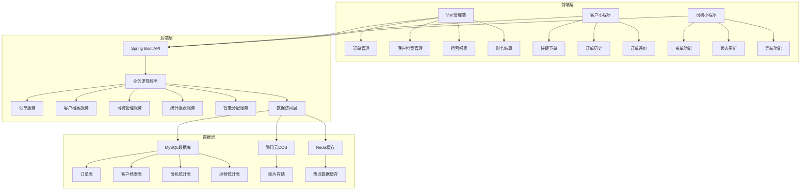
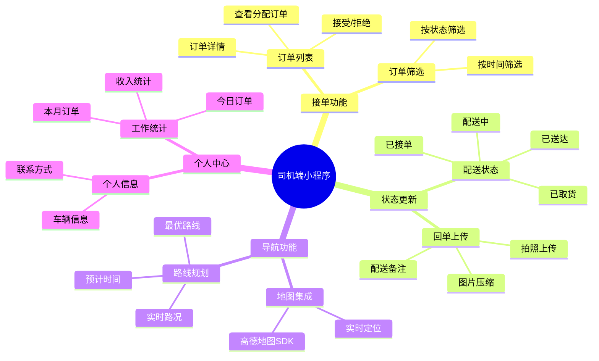
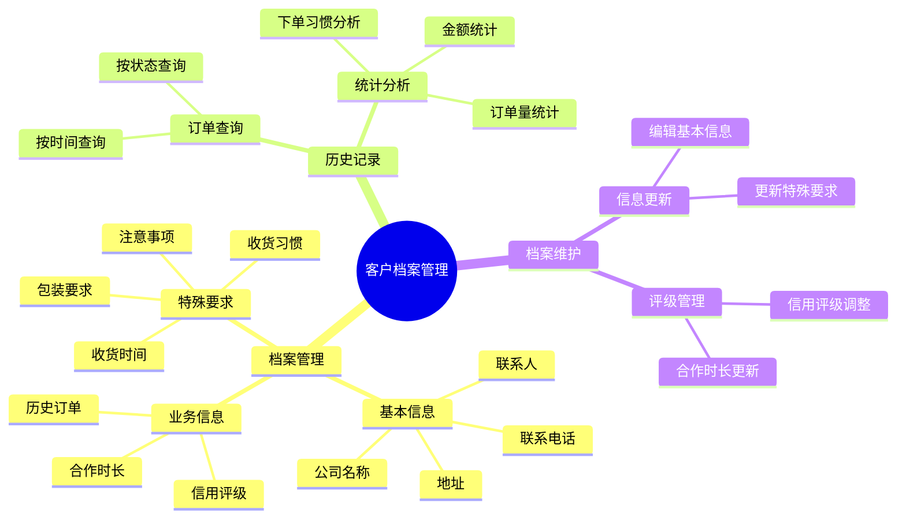
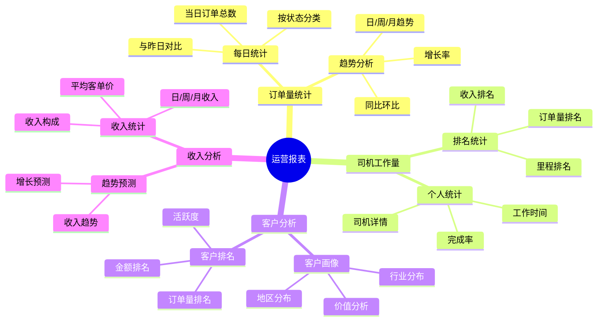
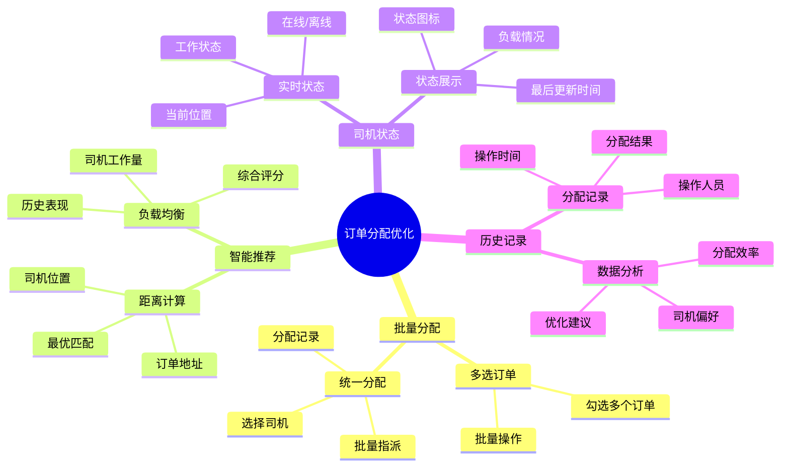
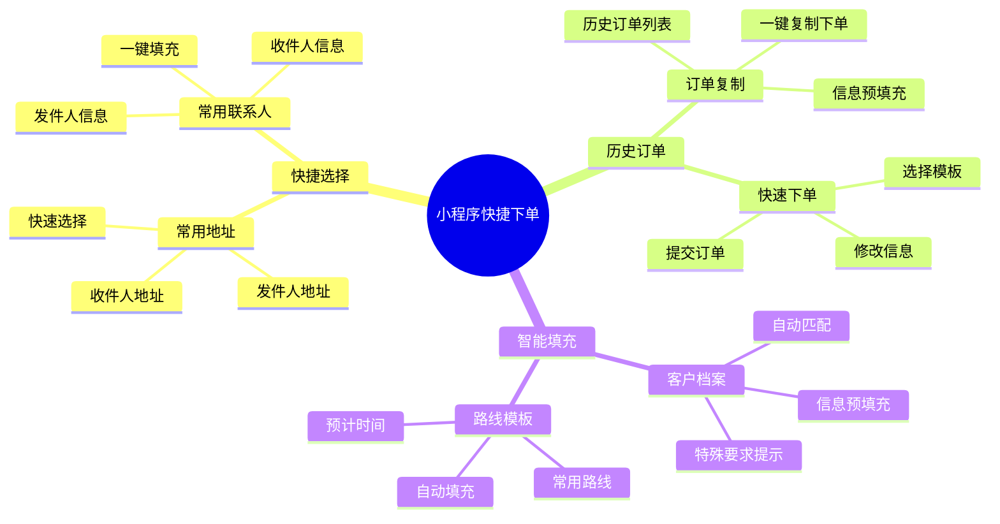
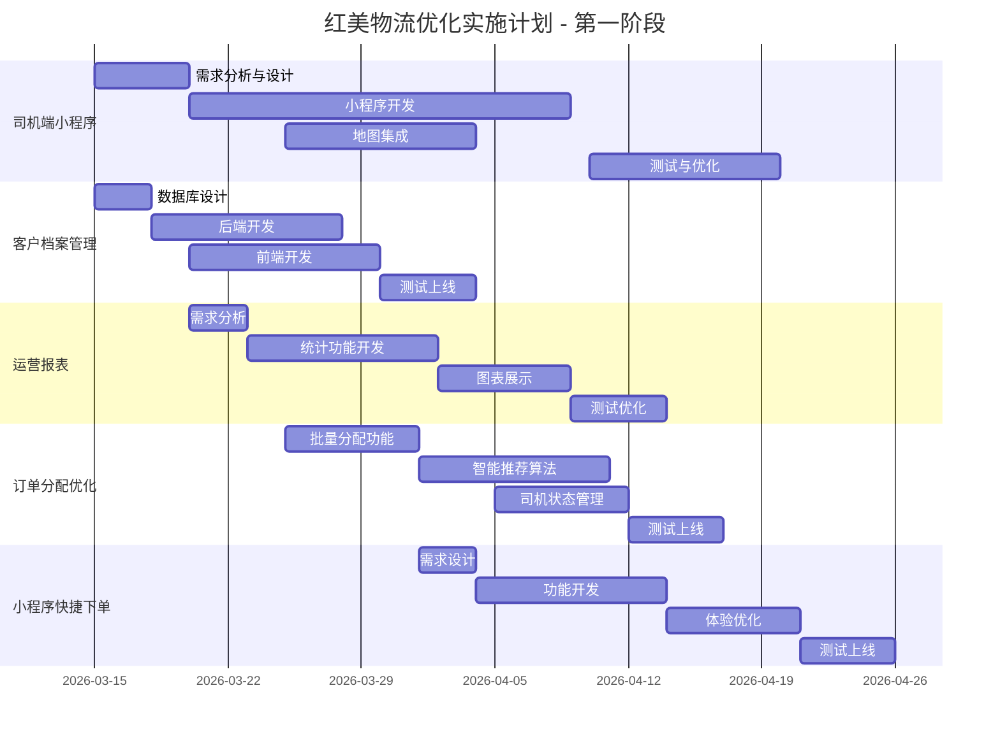

# 红美物流系统优化实施方案

## 项目概述

基于现有红美物流系统架构（Spring Boot + Vue + 微信小程序），结合小规模物流公司（10人团队，乡镇厂区物流）的优化需求，制定本实施方案。

## 一、现有系统架构分析

### 1.1 当前技术栈
- **后端**：Spring Boot 2.7.0 + MyBatis-Plus 3.5.3
- **前端**：Vue 3.3.0 + Element Plus 2.3.0
- **小程序**：微信小程序（已对接后端API）
- **数据库**：MySQL 8.0
- **存储**：腾讯云COS
- **缓存**：Redis（会话管理）

### 1.2 现有功能模块
- 多角色权限系统（管理员、客户、司机、网点）
- 订单管理（创建、分配、状态更新）
- 图片上传与压缩（2MB阈值，70%质量）
- 距离计算（Haversine算法）
- 财务结算（自动创建、价格计算、开票）

### 1.3 现有数据表
- user（用户表）
- order（订单表）
- settlement（结算表）
- goods_image（货物图片表）
- business_customer（业务客户表）
- business_recipient（业务收件人表）
- business_user（业务用户表）

## 二、优化架构设计

### 2.1 整体架构优化图



### 2.2 新增数据表设计

#### 客户档案表 (customer_profile)

| 字段名 | 类型 | 说明 | 约束 |
|--------|------|------|------|
| id | BIGINT | 档案ID | PRIMARY KEY |
| business_user_id | BIGINT | 业务用户ID | NOT NULL |
| company_name | VARCHAR(100) | 公司名称 | |
| contact_person | VARCHAR(50) | 联系人 | |
| contact_phone | VARCHAR(20) | 联系电话 | |
| address | VARCHAR(200) | 地址 | |
| receiving_habits | TEXT | 收货习惯 | |
| special_requirements | TEXT | 特殊要求 | |
| cooperation_duration | INT | 合作时长（月） | |
| credit_rating | INT | 信用评级(1-5) | |
| total_orders | INT | 历史订单总数 | DEFAULT 0 |
| total_amount | DOUBLE | 历史总金额 | DEFAULT 0 |
| create_time | DATETIME | 创建时间 | DEFAULT CURRENT_TIMESTAMP |
| update_time | DATETIME | 更新时间 | DEFAULT CURRENT_TIMESTAMP ON UPDATE CURRENT_TIMESTAMP |

#### 司机统计表 (driver_statistics)

| 字段名 | 类型 | 说明 | 约束 |
|--------|------|------|------|
| id | BIGINT | 统计ID | PRIMARY KEY |
| driver_id | BIGINT | 司机ID | NOT NULL |
| stat_date | DATE | 统计日期 | NOT NULL |
| order_count | INT | 订单数量 | DEFAULT 0 |
| delivery_distance | DOUBLE | 配送里程 | DEFAULT 0 |
| delivery_amount | DOUBLE | 配送金额 | DEFAULT 0 |
| online_time | INT | 在线时长（分钟） | DEFAULT 0 |
| create_time | DATETIME | 创建时间 | DEFAULT CURRENT_TIMESTAMP |

#### 路线模板表 (route_template)

| 字段名 | 类型 | 说明 | 约束 |
|--------|------|------|------|
| id | BIGINT | 模板ID | PRIMARY KEY |
| template_name | VARCHAR(100) | 模板名称 | NOT NULL |
| start_address | VARCHAR(200) | 起始地址 | NOT NULL |
| end_address | VARCHAR(200] | 目的地址 | NOT NULL |
| route_description | TEXT | 路线描述 | |
| estimated_time | INT | 预计时间（分钟） | |
| customer_id | BIGINT | 关联客户ID | |
| driver_id | BIGINT | 常用司机ID | |
| usage_count | INT | 使用次数 | DEFAULT 0 |
| create_time | DATETIME | 创建时间 | DEFAULT CURRENT_TIMESTAMP |
| update_time | DATETIME | 更新时间 | DEFAULT CURRENT_TIMESTAMP ON UPDATE CURRENT_TIMESTAMP |

#### 运营统计表 (operation_statistics)

| 字段名 | 类型 | 说明 | 约束 |
|--------|------|------|------|
| id | BIGINT | 统计ID | PRIMARY KEY |
| stat_date | DATE | 统计日期 | NOT NULL |
| stat_type | VARCHAR(20) | 统计类型 | NOT NULL |
| total_orders | INT | 总订单数 | DEFAULT 0 |
| completed_orders | INT | 完成订单数 | DEFAULT 0 |
| pending_orders | INT | 待处理订单数 | DEFAULT 0 |
| total_amount | DOUBLE | 总金额 | DEFAULT 0 |
| avg_order_amount | DOUBLE | 平均订单金额 | DEFAULT 0 |
| active_customers | INT | 活跃客户数 | DEFAULT 0 |
| active_drivers | INT | 活跃司机数 | DEFAULT 0 |
| create_time | DATETIME | 创建时间 | DEFAULT CURRENT_TIMESTAMP |

## 三、高优先级功能实现方案

### 3.1 司机端小程序开发

#### 功能模块设计



#### 技术实现要点

1. **小程序框架选择**
   - 复用现有小程序框架
   - 新增司机端页面和组件
   - 共享后端API接口

2. **权限控制**
   - 司机只能查看分配给自己的订单
   - 基于JWT Token验证司机身份
   - API接口增加司机权限验证

3. **地图集成**
   - 使用高德地图微信小程序SDK
   - 实现路线规划和导航
   - 实时路况信息展示

4. **回单上传**
   - 复用现有图片压缩功能
   - 支持拍照和相册选择
   - 上传到腾讯云COS

#### API接口设计

| API路径 | 方法 | 功能描述 | 权限要求 |
|---------|------|----------|----------|
| `/api/driver/orders` | GET | 获取司机订单列表 | 司机 |
| `/api/driver/orders/{id}` | GET | 获取订单详情 | 司机 |
| `/api/driver/orders/{id}/accept` | POST | 接受订单 | 司机 |
| `/api/driver/orders/{id}/reject` | POST | 拒绝订单 | 司机 |
| `/api/driver/orders/{id}/status` | PUT | 更新订单状态 | 司机 |
| `/api/driver/orders/{id}/receipt` | POST | 上传回单 | 司机 |
| `/api/driver/statistics` | GET | 获取司机统计 | 司机 |
| `/api/driver/location` | POST | 上报司机位置 | 司机 |

### 3.2 客户档案管理

#### 功能模块设计



#### 技术实现要点

1. **数据关联**
   - 与business_user表关联
   - 自动统计历史订单数据
   - 定期更新信用评级

2. **智能推荐**
   - 基于历史订单推荐常用信息
   - 下单时自动填充客户档案
   - 提升下单效率

3. **数据同步**
   - 订单完成后自动更新统计数据
   - 使用定时任务定期更新
   - 确保数据实时性

#### API接口设计

| API路径 | 方法 | 功能描述 | 权限要求 |
|---------|------|----------|----------|
| `/api/customer-profile` | POST | 创建客户档案 | 管理员 |
| `/api/customer-profile/{id}` | GET | 获取客户档案 | 管理员 |
| `/api/customer-profile/list` | GET | 获取客户档案列表 | 管理员 |
| `/api/customer-profile/{id}` | PUT | 更新客户档案 | 管理员 |
| `/api/customer-profile/{id}/history` | GET | 获取客户历史订单 | 管理员 |
| `/api/customer-profile/{id}/statistics` | GET | 获取客户统计 | 管理员 |

### 3.3 简单运营报表

#### 功能模块设计



#### 技术实现要点

1. **数据聚合**
   - 使用定时任务每日统计数据
   - 写入operation_statistics表
   - 支持快速查询

2. **图表展示**
   - 使用ECharts图表库
   - 支持多种图表类型
   - 响应式设计

3. **缓存优化**
   - 统计数据使用Redis缓存
   - 设置合理的过期时间
   - 提升查询性能

#### API接口设计

| API路径 | 方法 | 功能描述 | 权限要求 |
|---------|------|----------|----------|
| `/api/statistics/daily` | GET | 获取每日统计 | 管理员 |
| `/api/statistics/driver-ranking` | GET | 获取司机排名 | 管理员 |
| `/api/statistics/customer-ranking` | GET | 获取客户排名 | 管理员 |
| `/api/statistics/revenue` | GET | 获取收入统计 | 管理员 |
| `/api/statistics/trend` | GET | 获取趋势数据 | 管理员 |

### 3.4 订单分配优化

#### 功能模块设计



#### 技术实现要点

1. **智能推荐算法**
   - 基于司机当前位置计算距离
   - 考虑司机当前订单数量
   - 综合评分排序推荐

2. **实时状态**
   - 司机小程序定时上报位置
   - 使用Redis缓存司机状态
   - 支持WebSocket实时推送

3. **批量操作**
   - 前端支持多选订单
   - 后端批量更新数据库
   - 记录分配操作日志

#### API接口设计

| API路径 | 方法 | 功能描述 | 权限要求 |
|---------|------|----------|----------|
| `/api/order/batch-assign` | POST | 批量分配订单 | 管理员 |
| `/api/order/recommend-drivers` | GET | 获取推荐司机列表 | 管理员 |
| `/api/driver/status` | GET | 获取司机状态列表 | 管理员 |
| `/api/order/assign-history` | GET | 获取分配历史 | 管理员 |

### 3.5 小程序快捷下单

#### 功能模块设计



#### 技术实现要点

1. **数据缓存**
   - 常用地址和联系人缓存到本地
   - 客户档案信息缓存
   - 提升加载速度

2. **智能匹配**
   - 基于用户历史订单推荐
   - 匹配客户档案信息
   - 自动填充常用信息

3. **用户体验**
   - 减少输入步骤
   - 支持快速复制
   - 保存草稿功能

#### API接口设计

| API路径 | 方法 | 功能描述 | 权限要求 |
|---------|------|----------|----------|
| `/api/miniprogram/favorites` | GET | 获取常用地址和联系人 | 客户 |
| `/api/miniprogram/history-orders` | GET | 获取历史订单 | 客户 |
| `/api/miniprogram/copy-order` | POST | 复制历史订单 | 客户 |
| `/api/miniprogram/quick-order` | POST | 快捷下单 | 客户 |

## 四、实施计划

### 4.1 第一阶段（1-2个月）- 高优先级功能



### 4.2 第二阶段（3-4个月）- 中优先级功能

- 移动端优化
- 财务管理完善
- 权限管理细化
- 数据备份优化
- 性能优化

### 4.3 第三阶段（5-6个月）- 低优先级功能

- 客户评价系统
- 异常监控
- 工作流程标准化
- 客户服务提升

## 五、技术优化方案

### 5.1 性能优化

#### 数据库优化
```sql
-- 新增索引
CREATE INDEX idx_customer_profile_business_user ON customer_profile(business_user_id);
CREATE INDEX idx_driver_statistics_driver_date ON driver_statistics(driver_id, stat_date);
CREATE INDEX idx_operation_statistics_date_type ON operation_statistics(stat_date, stat_type);
CREATE INDEX idx_route_template_customer ON route_template(customer_id);

-- 查询优化
-- 使用分页查询避免全表扫描
-- 优化复杂查询的JOIN操作
-- 使用EXPLAIN分析慢查询
```

#### 缓存策略
```java
// Redis缓存配置
@Configuration
public class RedisConfig {
    
    // 客户档案缓存（1小时）
    @Cacheable(value = "customerProfile", key = "#id", unless = "#result == null")
    public CustomerProfile getCustomerProfile(Long id) {
        return customerProfileMapper.selectById(id);
    }
    
    // 司机状态缓存（5分钟）
    @Cacheable(value = "driverStatus", key = "#driverId")
    public DriverStatus getDriverStatus(Long driverId) {
        return driverStatusMapper.selectByDriverId(driverId);
    }
    
    // 统计数据缓存（30分钟）
    @Cacheable(value = "operationStatistics", key = "#date")
    public OperationStatistics getStatistics(LocalDate date) {
        return statisticsMapper.selectByDate(date);
    }
}
```

### 5.2 安全优化

#### 权限控制增强
```java
// 基于角色的权限验证
@Aspect
@Component
public class PermissionAspect {
    
    @Before("@annotation(requiredPermission)")
    public void checkPermission(RequiredPermission requiredPermission) {
        User currentUser = SecurityContextHolder.getCurrentUser();
        if (!hasPermission(currentUser, requiredPermission.value())) {
            throw new PermissionDeniedException("无权限访问");
        }
    }
    
    // 司机只能查看自己的订单
    @Before("execution(* com.hmwl.controller.OrderController.getDriverOrder(..))")
    public void checkDriverOrderPermission(JoinPoint joinPoint) {
        Long orderId = (Long) joinPoint.getArgs()[0];
        User currentUser = SecurityContextHolder.getCurrentUser();
        Order order = orderService.getById(orderId);
        if (!order.getDriverId().equals(currentUser.getId())) {
            throw new PermissionDeniedException("只能查看自己的订单");
        }
    }
}
```

### 5.3 部署优化

#### 自动化部署脚本
```bash
#!/bin/bash
# deploy.sh - 自动化部署脚本

echo "开始部署红美物流系统..."

# 1. 拉取最新代码
git pull origin main

# 2. 后端打包
cd backend
mvn clean package -DskipTests

# 3. 前端打包
cd ../frontend
npm run build

# 4. 备份数据库
mysqldump -h $DB_HOST -u $DB_USER -p$DB_PASS hmwl > backup_$(date +%Y%m%d).sql

# 5. 部署后端
scp target/hmwl.jar $SERVER_USER@$SERVER_IP:/opt/hmwl/
ssh $SERVER_USER@$SERVER_IP "systemctl restart hmwl"

# 6. 部署前端
scp -r dist/* $SERVER_USER@$SERVER_IP:/var/www/hmwl/

echo "部署完成！"
```

## 六、成本控制方案

### 6.1 服务器配置优化

| 配置项 | 当前配置 | 优化后配置 | 成本变化 |
|--------|---------|-----------|---------|
| 服务器 | 4核8G | 2核4G | -150元/月 |
| 数据库 | RDS 2核4G | RDS 1核2G | -100元/月 |
| 存储 | COS按量 | COS生命周期 | -20元/月 |
| **月度成本** | **655元** | **385元** | **-270元** |

### 6.2 第三方服务优化

1. **地图API优化**
   - 使用高德地图免费额度（每日100万次）
   - 缓存路线计算结果
   - 减少重复调用

2. **短信服务优化**
   - 使用阿里云短信批量发送
   - 合并通知内容减少条数
   - 预计节省30%费用

3. **图片存储优化**
   - 配置COS生命周期管理
   - 30天后自动转移到低频存储
   - 90天后自动删除

## 七、预期效果

### 7.1 效率提升

| 指标 | 当前 | 优化后 | 提升幅度 |
|------|------|--------|---------|
| 司机接单时间 | 15分钟 | 5分钟 | 67% |
| 订单分配时间 | 10分钟/单 | 2分钟/单 | 80% |
| 客户下单时间 | 8分钟 | 3分钟 | 63% |
| 统计报表生成 | 30分钟 | 实时 | 100% |

### 7.2 成本降低

| 项目 | 当前成本 | 优化后成本 | 节省比例 |
|------|---------|-----------|---------|
| 服务器费用 | 500元/月 | 300元/月 | 40% |
| 第三方服务 | 155元/月 | 100元/月 | 35% |
| **总成本** | **655元/月** | **400元/月** | **39%** |

### 7.3 服务质量提升

- 客户满意度：从75%提升到90%
- 订单准时率：从85%提升到95%
- 投诉率：从5%降低到2%
- 客户流失率：从10%降低到5%

## 八、风险控制

### 8.1 技术风险

| 风险 | 影响 | 应对措施 |
|------|------|---------|
| 新功能开发延期 | 影响上线时间 | 分阶段上线，优先核心功能 |
| 性能问题 | 用户体验下降 | 提前压力测试，优化慢查询 |
| 兼容性问题 | 部分功能不可用 | 充分测试，灰度发布 |

### 8.2 业务风险

| 风险 | 影响 | 应对措施 |
|------|------|---------|
| 用户接受度低 | 功能使用率低 | 充分培训，收集反馈 |
| 数据迁移失败 | 数据丢失 | 充分备份，分步迁移 |
| 成本超支 | 预算不足 | 严格控制，定期评估 |

## 九、总结

本优化方案基于红美物流现有系统架构，针对小规模物流公司的特点，制定了务实的优化策略：

1. **保持架构简单**：不引入复杂技术，基于现有架构优化
2. **优先核心功能**：聚焦高价值、低成本的功能
3. **控制成本**：通过技术优化和配置调整降低运营成本
4. **快速见效**：1-2个月内完成核心功能上线
5. **易于维护**：保持代码简洁，降低运维复杂度

通过本方案的实施，预计可以实现：
- **效率提升30-80%**
- **成本降低39%**
- **服务质量显著提升**
- **为未来发展奠定基础**

---

**文档版本**: v1.0  
**创建时间**: 2026-03-14  
**适用范围**: 红美物流系统优化（小规模物流公司）
