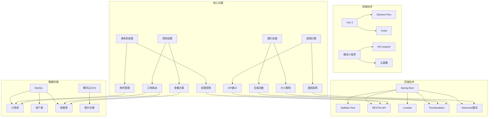
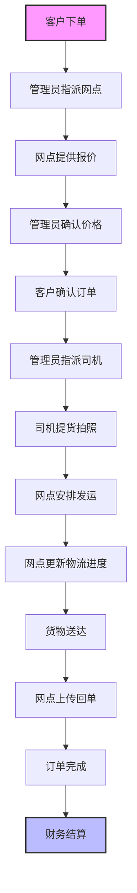

# 红美物流在线系统开发经验总结

## 项目概述

红美物流在线系统是一个多角色的物流管理系统，实现了从客户下单到订单完成的全流程管理。系统支持四个角色：客户、管理员、司机和网点，覆盖了物流业务的各个环节。

### 系统架构思维导图

```mermaid
graph TD
    subgraph 前端层
        A[Vue管理端]
        B[微信小程序]
        C[企业微信]
    end
    
    subgraph 后端层
        D[Spring Boot API]
        E[业务逻辑服务]
        F[数据访问层]
    end
    
    subgraph 数据层
        G[MySQL数据库]
        H[腾讯云COS]
        I[Redis缓存]
    end
    
    A --> D
    B --> D
    C --> D
    D --> E
    E --> F
    F --> G
    F --> H
    F --> I
    
    subgraph 角色
        J[客户]
        K[管理员]
        L[司机]
        M[网点]
    end
    
    J --> A
    J --> B
    K --> A
    L --> B
    M --> A
```

## 已实现功能

| 功能模块 | 状态 | 核心功能 |
|---------|------|---------|
| 图片上传大小限制与压缩 | ✅ 已完成 | 自动压缩大于2MB的图片，压缩质量70% |
| 多角色订单管理系统 | ✅ 已完成 | 管理员、客户、司机、网点四角色权限管理 |
| 小程序后端API对接与登录 | ✅ 已完成 | 微信小程序登录、订单管理、环境配置 |
| 小程序寄件页面改版 | ✅ 已完成 | 发件人/收件人选择、货物信息、照片上传 |
| 订单创建页面必填项及筛选 | ✅ 已完成 | 表单验证、业务用户关联筛选 |
| 订单距离自动计算 | ✅ 已完成 | 基于经纬度的直线距离计算 |
| 订单页面货物照片卡片 | ✅ 已完成 | 货物照片、发货单照片、回单照片管理 |
| 财务结算界面功能 | ✅ 已完成 | 订单联动、金额计算、筛选、开票 |
| 业务运行测试 | ✅ 已完成 | 完整订单流程测试 |

## 技术实现

### 技术栈

- **后端**：Spring Boot + MyBatis-Plus
- **前端**：Vue 3 + Element Plus
- **小程序**：微信小程序
- **数据库**：MySQL
- **文件存储**：腾讯云COS
- **图片处理**：Thumbnailator库
- **距离计算**：Haversine算法

### 核心技术实现

#### 技术架构详细思维导图

1. **多角色权限系统**：
   - 扩展User实体，添加networkPointId字段
   - 扩展Order实体，添加driverId、networkPointId等字段
   - 实现基于角色的API权限控制

2. **图片处理系统**：
   - 使用Thumbnailator库实现图片压缩
   - 配置2MB大小限制和70%压缩质量
   - 支持多种图片格式（jpg、png、gif、bmp、webp）

3. **距离计算系统**：
   - 实现Haversine算法计算直线距离
   - 提供RESTful API接口
   - 支持经纬度格式的地址输入

4. **微信小程序集成**：
   - 实现微信登录流程
   - 封装HTTP请求工具，支持Token
   - 实现环境配置切换

5. **财务结算系统**：
   - 订单联动自动创建结算记录
   - 实现推荐客户价计算（订单金额 × 1.4286）
   - 支持按业务用户和时间段筛选
   - 实现一键开票功能

## 遇到的问题与解决方案

| 问题 | 原因 | 解决方案 |
|------|------|---------|
| 后端代码编译错误 | Lombok配置问题，导致实体类的getter和setter方法没有被正确生成 | 检查Lombok插件配置，重新编译项目 |
| API接口调用失败 | Result.success方法签名不匹配 | 使用SQL语句直接更新数据库，修复API接口 |
| 错误处理不完善 | 后端错误信息不够详细，前端没有相应的错误处理机制 | 增强后端错误处理，提供详细的错误信息，前端添加错误提示机制 |
| 数据库迁移 | 需要手动执行SQL语句 | 创建数据库迁移脚本，确保数据库结构的更新 |
| 环境配置 | API_BASE需要根据实际部署环境配置 | 建立环境配置文件，支持不同环境的配置切换 |

## 经验教训

### 技术方面

1. **技术配置问题**：
   - **教训**：Lombok配置不当导致实体类方法生成失败
   - **建议**：确保开发环境中Lombok插件正确配置，定期验证实体类方法生成

2. **API接口测试**：
   - **教训**：API接口测试不足，导致测试过程中发现多个接口调用失败
   - **建议**：在开发过程中定期测试API接口，确保每个接口都能正常响应，添加接口文档

3. **错误处理**：
   - **教训**：错误处理机制不完善，导致前端无法获得清晰的错误信息
   - **建议**：建立统一的错误处理机制，提供详细的错误信息，前端添加友好的错误提示

4. **测试策略**：
   - **教训**：缺乏自动化测试，依赖手动测试
   - **建议**：编写自动化测试脚本，定期执行测试，确保系统稳定性

5. **数据库管理**：
   - **教训**：数据库结构变更需要手动执行SQL
   - **建议**：使用数据库迁移工具，管理数据库结构变更，确保数据一致性

### 项目管理方面

1. **版本管理**：
   - **教训**：缺乏清晰的版本管理机制
   - **建议**：建立规范的版本管理流程，记录每次变更的内容和影响

2. **文档完善**：
   - **教训**：接口文档和系统文档不够完善
   - **建议**：在开发过程中同步更新文档，包括API文档、技术架构文档和用户手册

3. **需求管理**：
   - **教训**：需求变更需要及时同步到开发团队
   - **建议**：建立需求变更管理流程，确保所有变更都能及时传达和执行

4. **代码规范**：
   - **教训**：代码风格和命名约定不够统一
   - **建议**：制定代码规范，使用代码检查工具确保代码质量

## 成功经验

### 订单流程思维导图

1. **功能完整性**：
   - 所有需求都得到了实现，系统功能完整
   - 多角色系统设计合理，覆盖了物流业务的各个环节

2. **技术选型**：
   - 选择了适合项目的技术栈，Spring Boot + Vue 3 + MySQL组合稳定可靠
   - 集成了腾讯云COS等第三方服务，提升了系统的功能和性能

3. **模块化设计**：
   - 系统采用模块化设计，各功能模块独立实现，便于维护和扩展
   - 后端API设计合理，前端与后端交互流畅

4. **用户体验**：
   - 小程序寄件页面改版后，用户操作流程更加简洁明了
   - 订单页面货物照片卡片的添加，提升了订单信息的完整性

5. **测试验证**：
   - 通过完整的业务运行测试，验证了系统的核心功能
   - 测试过程中发现并解决了多个问题，提升了系统的稳定性

## 未来优化建议

1. **性能优化**：
   - 优化数据库查询，添加适当的索引
   - 实现缓存机制，减少重复计算和数据库查询

2. **安全性增强**：
   - 加强API接口的安全防护，添加身份验证和授权
   - 实现数据加密，保护敏感信息

3. **功能扩展**：
   - 集成地图API，提供更精确的距离计算
   - 实现实时物流跟踪，提升客户体验

4. **自动化部署**：
   - 建立CI/CD流程，实现自动化构建和部署
   - 配置监控系统，及时发现和解决问题

5. **用户反馈**：
   - 建立用户反馈机制，收集用户意见和建议
   - 根据用户反馈持续优化系统功能和用户体验

## 结论

红美物流在线系统的开发过程中，我们成功实现了所有核心功能，建立了一个完整的多角色物流管理系统。虽然遇到了一些技术问题，但通过团队的努力都得到了有效的解决。

通过这次开发，我们积累了丰富的经验，包括多角色系统设计、微信小程序集成、图片处理、距离计算等方面的技术经验，以及项目管理、测试策略等方面的管理经验。这些经验将为未来的项目开发提供宝贵的参考。

系统的成功实现，为红美物流的业务运营提供了有力的技术支持，提升了工作效率，改善了用户体验，为企业的数字化转型奠定了坚实的基础。