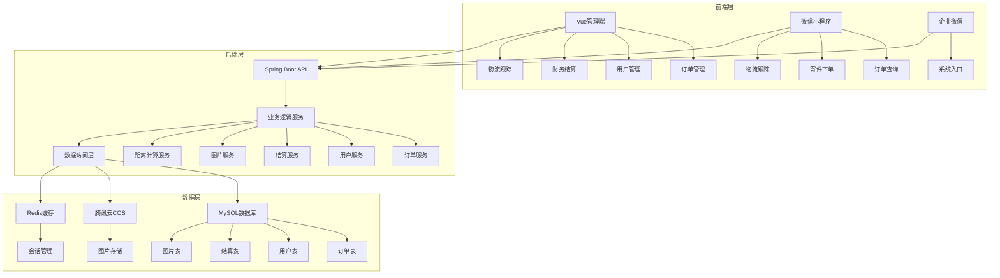
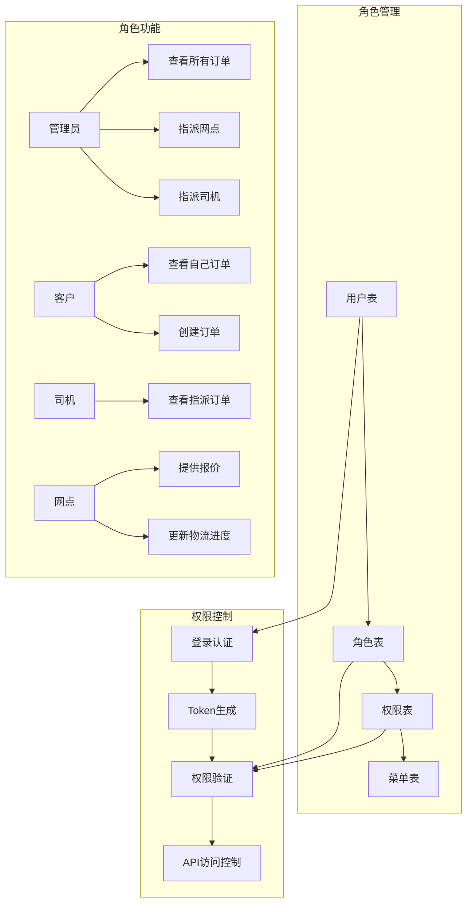
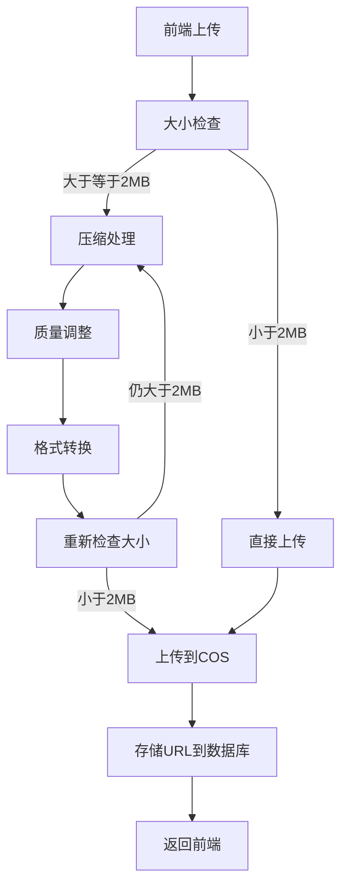
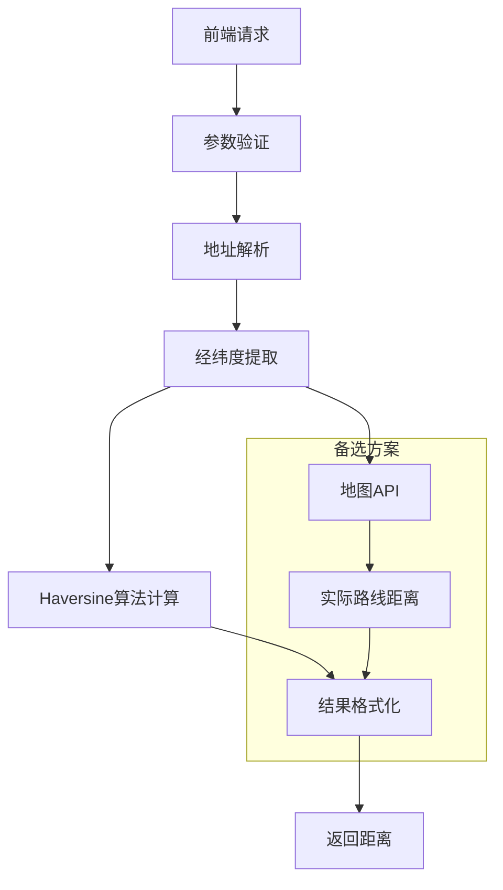
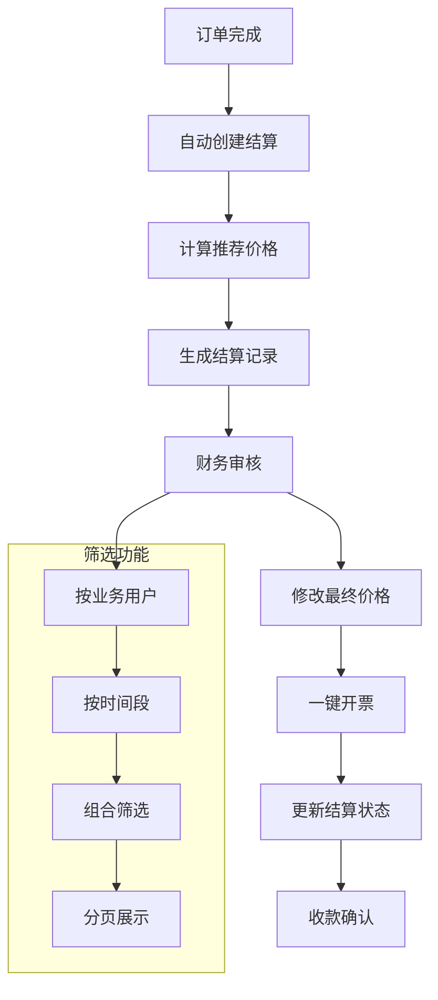
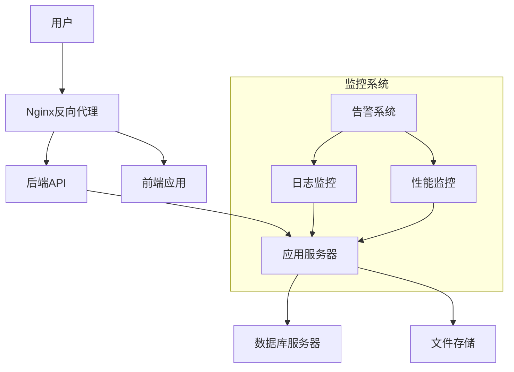

# 红美物流在线系统技术架构设计

## 1. 系统架构概述

### 1.1 整体架构



### 1.2 技术栈选择

| 类别 | 技术 | 版本 | 选型理由 |
|------|------|------|----------|
| 后端框架 | Spring Boot | 2.7.0 | 快速开发，生态丰富，易于集成 |
| ORM框架 | MyBatis-Plus | 3.5.3 | 简化CRUD操作，支持Lambda表达式 |
| 数据库 | MySQL | 8.0 | 稳定可靠，适合关系型数据存储 |
| 前端框架 | Vue | 3.3.0 | 响应式设计，组件化开发 |
| UI组件库 | Element Plus | 2.3.0 | 丰富的组件，美观的界面 |
| 小程序 | 微信小程序 | 最新版 | 覆盖微信生态，用户基数大 |
| 文件存储 | 腾讯云COS | 最新版 | 安全可靠，易于集成 |
| 图片处理 | Thumbnailator | 0.4.19 | 轻量级，功能强大 |

## 2. 核心功能模块设计

### 2.1 多角色权限系统



### 2.2 图片上传与压缩系统



### 2.3 距离计算系统



### 2.4 财务结算系统



## 3. 数据库设计

### 3.1 核心表结构

#### 用户表 (user)

| 字段名 | 类型 | 说明 | 约束 |
|--------|------|------|------|
| id | BIGINT | 用户ID | PRIMARY KEY |
| username | VARCHAR(50) | 用户名 | UNIQUE |
| password | VARCHAR(100) | 密码 | NOT NULL |
| real_name | VARCHAR(50) | 真实姓名 | |
| phone | VARCHAR(20) | 手机号 | |
| user_type | INT | 用户类型 | NOT NULL |
| network_point_id | BIGINT | 网点ID | |
| openid | VARCHAR(100) | 微信openid | |
| status | INT | 状态 | DEFAULT 0 |
| create_time | DATETIME | 创建时间 | DEFAULT CURRENT_TIMESTAMP |

#### 订单表 (order)

| 字段名 | 类型 | 说明 | 约束 |
|--------|------|------|------|
| id | BIGINT | 订单ID | PRIMARY KEY |
| order_no | VARCHAR(50) | 订单号 | UNIQUE |
| sender_name | VARCHAR(50) | 发件人姓名 | NOT NULL |
| sender_phone | VARCHAR(20) | 发件人电话 | NOT NULL |
| sender_address | VARCHAR(200) | 发件人地址 | NOT NULL |
| receiver_name | VARCHAR(50) | 收件人姓名 | NOT NULL |
| receiver_phone | VARCHAR(20) | 收件人电话 | NOT NULL |
| receiver_address | VARCHAR(200) | 收件人地址 | NOT NULL |
| goods_name | VARCHAR(100) | 货物名称 | NOT NULL |
| weight | DOUBLE | 重量 | NOT NULL |
| volume | DOUBLE | 体积 | |
| remark | VARCHAR(500) | 备注 | |
| status | INT | 订单状态 | DEFAULT 0 |
| driver_id | BIGINT | 司机ID | |
| network_point_id | BIGINT | 网点ID | |
| base_fee | DOUBLE | 基础费用 | |
| coefficient | DOUBLE | 系数 | DEFAULT 1.4286 |
| customer_price | DOUBLE | 客户报价 | |
| logistics_status | INT | 物流状态 | DEFAULT 0 |
| logistics_progress | VARCHAR(500) | 物流进度 | |
| distance | DOUBLE | 距离 | |
| create_time | DATETIME | 创建时间 | DEFAULT CURRENT_TIMESTAMP |
| update_time | DATETIME | 更新时间 | DEFAULT CURRENT_TIMESTAMP ON UPDATE CURRENT_TIMESTAMP |

#### 结算表 (settlement)

| 字段名 | 类型 | 说明 | 约束 |
|--------|------|------|------|
| id | BIGINT | 结算ID | PRIMARY KEY |
| order_no | VARCHAR(50) | 订单号 | |
| customer_name | VARCHAR(100) | 客户名称 | |
| order_amount | DOUBLE | 订单金额 | |
| recommended_price | DOUBLE | 推荐价格 | |
| final_amount | DOUBLE | 最终金额 | |
| status | INT | 结算状态 | DEFAULT 0 |
| invoice_no | VARCHAR(50) | 发票号 | |
| create_time | DATETIME | 创建时间 | DEFAULT CURRENT_TIMESTAMP |
| update_time | DATETIME | 更新时间 | DEFAULT CURRENT_TIMESTAMP ON UPDATE CURRENT_TIMESTAMP |

#### 货物图片表 (goods_image)

| 字段名 | 类型 | 说明 | 约束 |
|--------|------|------|------|
| id | BIGINT | 图片ID | PRIMARY KEY |
| order_id | BIGINT | 订单ID | NOT NULL |
| image_type | VARCHAR(20) | 图片类型 | NOT NULL |
| image_url | VARCHAR(500) | 图片URL | NOT NULL |
| create_time | DATETIME | 创建时间 | DEFAULT CURRENT_TIMESTAMP |

### 3.2 索引设计

```sql
-- 订单表索引
CREATE INDEX idx_order_status ON `order`(status);
CREATE INDEX idx_order_network_point ON `order`(network_point_id);
CREATE INDEX idx_order_driver ON `order`(driver_id);
CREATE INDEX idx_order_create_time ON `order`(create_time);

-- 货物图片表索引
CREATE INDEX idx_goods_image_order ON goods_image(order_id);
CREATE INDEX idx_goods_image_type ON goods_image(image_type);

-- 结算表索引
CREATE INDEX idx_settlement_status ON settlement(status);
CREATE INDEX idx_settlement_customer ON settlement(customer_name);
CREATE INDEX idx_settlement_create_time ON settlement(create_time);
```

## 4. API接口设计

### 4.1 订单管理接口

| API路径 | 方法 | 模块 | 功能描述 |
|---------|------|------|----------|
| `/api/order` | POST | 订单管理 | 创建订单 |
| `/api/order/{id}` | GET | 订单管理 | 获取订单详情 |
| `/api/order/list` | GET | 订单管理 | 获取订单列表 |
| `/api/order/assign-network` | POST | 订单管理 | 指派网点 |
| `/api/order/provide-price` | POST | 订单管理 | 提供报价 |
| `/api/order/assign-driver` | POST | 订单管理 | 指派司机 |
| `/api/order/update-logistics` | POST | 订单管理 | 更新物流进度 |
| `/api/order/complete` | POST | 订单管理 | 完成订单 |
| `/api/order/calculate-distance` | POST | 订单管理 | 计算距离 |

### 4.2 用户管理接口

| API路径 | 方法 | 模块 | 功能描述 |
|---------|------|------|----------|
| `/api/user/login` | POST | 用户管理 | 用户登录 |
| `/api/user/info` | GET | 用户管理 | 获取用户信息 |
| `/api/user/list` | GET | 用户管理 | 获取用户列表 |
| `/api/user/update` | PUT | 用户管理 | 更新用户信息 |
| `/api/user/wxLogin` | POST | 用户管理 | 微信登录 |

### 4.3 结算管理接口

| API路径 | 方法 | 模块 | 功能描述 |
|---------|------|------|----------|
| `/api/settlement/list` | GET | 结算管理 | 获取结算列表 |
| `/api/settlement/create-from-order` | POST | 结算管理 | 从订单创建结算 |
| `/api/settlement/update-amount` | PUT | 结算管理 | 更新结算金额 |
| `/api/settlement/update-status` | PUT | 结算管理 | 更新结算状态 |
| `/api/settlement/generate-invoice` | POST | 结算管理 | 生成发票 |

### 4.4 图片管理接口

| API路径 | 方法 | 模块 | 功能描述 |
|---------|------|------|----------|
| `/api/order/goods-image/upload` | POST | 图片管理 | 上传货物图片 |
| `/api/order/goods-image/list/{orderId}` | GET | 图片管理 | 获取订单图片列表 |
| `/api/order/goods-image/{id}` | DELETE | 图片管理 | 删除图片 |

## 5. 部署与集成方案

### 5.1 环境配置

| 环境 | 前端地址 | 后端地址 | 数据库 |
|------|---------|---------|--------|
| 开发环境 | http://localhost:3000 | http://localhost:8081/api | localhost:3306/hmwl |
| 测试环境 | http://test.hmwl.com | http://api.test.hmwl.com | test.hmwl.com:3306/hmwl |
| 生产环境 | http://hmwl.com | http://api.hmwl.com | prod.hmwl.com:3306/hmwl |

### 5.2 部署架构



### 5.3 集成方案

1. **微信小程序集成**：
   - 实现微信登录
   - 封装HTTP请求工具
   - 配置环境切换

2. **企业微信集成**：
   - 创建应用入口
   - 实现单点登录
   - 集成消息通知

3. **腾讯云COS集成**：
   - 配置存储桶
   - 实现图片上传
   - 管理文件生命周期

## 6. 性能优化策略

### 6.1 数据库优化

1. **索引优化**：
   - 为常用查询字段添加索引
   - 定期分析和优化索引

2. **查询优化**：
   - 使用分页查询
   - 避免全表扫描
   - 使用预编译语句

3. **缓存策略**：
   - 使用Redis缓存热点数据
   - 实现缓存过期机制

### 6.2 接口优化

1. **响应时间优化**：
   - 减少数据库查询次数
   - 优化业务逻辑
   - 使用异步处理

2. **带宽优化**：
   - 压缩响应数据
   - 优化图片加载
   - 使用CDN加速

3. **并发处理**：
   - 使用线程池
   - 实现请求限流
   - 优化锁机制

### 6.3 前端优化

1. **加载优化**：
   - 代码分割
   - 懒加载
   - 缓存静态资源

2. **渲染优化**：
   - 减少DOM操作
   - 使用虚拟列表
   - 优化组件渲染

3. **用户体验优化**：
   - 实现骨架屏
   - 添加加载状态
   - 优化交互反馈

## 7. 安全策略

### 7.1 认证与授权

1. **用户认证**：
   - 使用JWT令牌
   - 实现密码加密
   - 支持多因素认证

2. **权限控制**：
   - 基于角色的权限控制
   - 细粒度权限管理
   - 权限验证中间件

### 7.2 数据安全

1. **数据加密**：
   - 敏感数据加密存储
   - 传输数据加密
   - 数据库加密

2. **数据验证**：
   - 输入验证
   - 输出编码
   - 防止SQL注入

### 7.3 系统安全

1. **网络安全**：
   - 使用HTTPS
   - 配置防火墙
   - 防止DDoS攻击

2. **应用安全**：
   - 定期漏洞扫描
   - 安全补丁更新
   - 代码安全审计

## 8. 监控与运维

### 8.1 监控系统

1. **日志监控**：
   - 集中式日志管理
   - 日志分析
   - 异常告警

2. **性能监控**：
   - 系统资源监控
   - 接口响应时间监控
   - 数据库性能监控

3. **业务监控**：
   - 订单量监控
   - 系统使用情况监控
   - 异常业务监控

### 8.2 运维流程

1. **部署流程**：
   - 自动化构建
   - 灰度发布
   - 回滚机制

2. **备份策略**：
   - 数据备份
   - 代码备份
   - 配置备份

3. **故障处理**：
   - 故障定位
   - 故障修复
   - 故障预防

## 9. 扩展性设计

### 9.1 模块扩展

1. **微服务架构**：
   - 服务拆分
   - 服务注册与发现
   - 负载均衡

2. **插件系统**：
   - 可插拔架构
   - 扩展点设计
   - 插件管理

### 9.2 功能扩展

1. **API扩展**：
   - 统一API设计
   - 版本管理
   - 接口文档

2. **集成扩展**：
   - 第三方系统集成
   - 开放平台
   - Webhook机制

### 9.3 技术扩展

1. **技术栈扩展**：
   - 容器化部署
   - 云原生架构
   - 自动化运维

2. **数据扩展**：
   - 大数据处理
   - 数据分析
   - 数据可视化

## 10. 总结与展望

### 10.1 架构优势

1. **模块化设计**：
   - 各模块独立实现，便于维护和扩展
   - 清晰的责任边界，降低耦合度

2. **技术选型合理**：
   - 选择成熟稳定的技术栈
   - 适合物流行业的业务特点

3. **扩展性强**：
   - 支持业务快速迭代
   - 适应未来业务增长

### 10.2 未来规划

1. **功能增强**：
   - 实时物流跟踪
   - 智能路径规划
   - 预测性分析

2. **技术升级**：
   - 微服务改造
   - 容器化部署
   - 人工智能应用

3. **生态建设**：
   - 开放平台
   - 合作伙伴集成
   - 行业标准制定

## 11. 附录

### 11.1 技术文档

- [API接口文档](https://api.hmwl.com/docs)
- [数据库设计文档](https://docs.hmwl.com/database)
- [部署指南](https://docs.hmwl.com/deployment)

### 11.2 开发规范

- [代码规范](https://docs.hmwl.com/code-standard)
- [命名规范](https://docs.hmwl.com/naming-standard)
- [提交规范](https://docs.hmwl.com/commit-standard)

### 11.3 故障处理

- [常见问题](https://docs.hmwl.com/faq)
- [故障排查](https://docs.hmwl.com/troubleshooting)
- [应急响应](https://docs.hmwl.com/emergency)